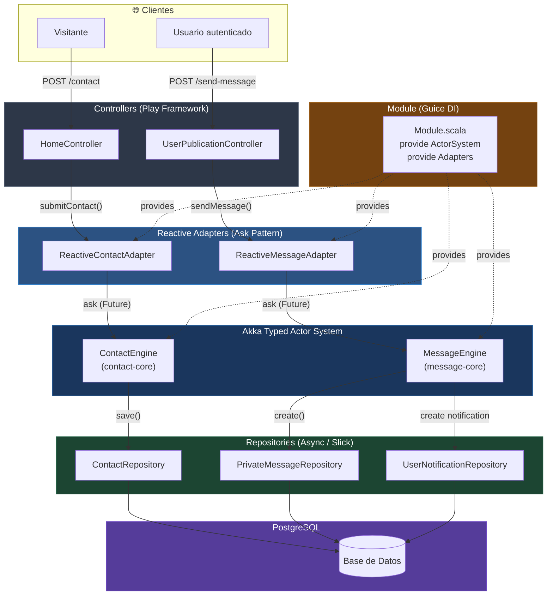
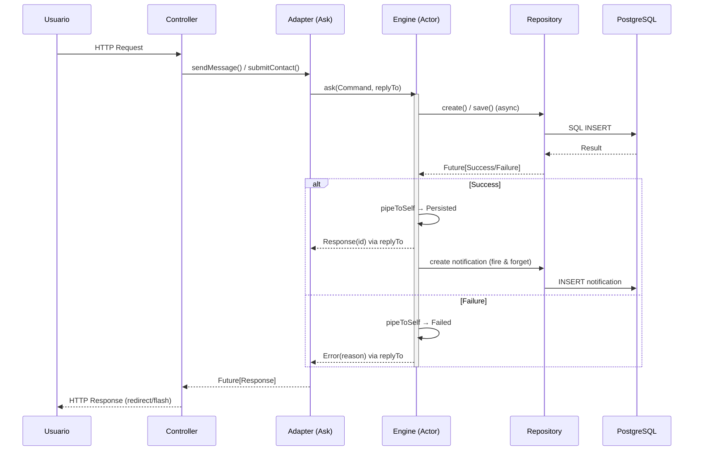

# ⚡ Reactive Manifesto

Aplicación web que implementa los principios del [Manifiesto Reactivo](https://www.reactivemanifesto.org/) con **Play Framework**, **Akka Typed** y **Scala**.

---

## 🛠️ Stack Tecnológico

| Capa | Tecnología |
|------|-----------|
| **Backend** | Play Framework 3.0.1 |
| **Lenguaje** | Scala 2.13.12 |
| **Sistema Reactivo** | Akka Typed 2.8.5 |
| **Persistencia** | Slick 3 + H2 (dev) / PostgreSQL (prod) |
| **Frontend** | Twirl templates, CSS3, Vanilla JS |
| **DI** | Guice |
| **Build** | SBT 1.9.7 |

---

## 🚀 Inicio Rápido

```bash
# Clonar
git clone https://github.com/federicopfund/Reactive-Manifiesto.git
cd Reactive-Manifiesto

# Ejecutar
sbt run
```

Disponible en **http://localhost:9000**

```bash
# Comando todo-en-uno (limpia, compila e inicia)
fuser -k 9000/tcp 2>/dev/null && sbt clean compile run
```

---

## 🏗️ Arquitectura de Agentes

El proyecto sigue una **arquitectura de agentes reactivos** con 4 capas desacopladas:



### Capas del sistema

#### 1. Agentes (Actors) — `core/`

| Actor | Sistema | Responsabilidad |
|-------|---------|-----------------|
| **ContactEngine** | `contact-core` | Procesa formularios de contacto: persiste en DB y responde |
| **MessageEngine** | `message-core` | Mensajería privada: persiste mensaje → crea notificación → responde |

Ambos usan **Akka Typed** con `Behaviors.receive` y el patrón `pipeToSelf` para manejar futuros asíncronos sin romper el modelo de actores.

#### 2. Adaptadores Reactivos — `services/`

| Adapter | Actor target |
|---------|-------------|
| **ReactiveContactAdapter** | ContactEngine |
| **ReactiveMessageAdapter** | MessageEngine |

Exponen una interfaz `Future`-based usando el **Ask Pattern** (`system.ask`) con timeout de 5 segundos, permitiendo a los controllers consumir respuestas de los actores como Futures estándar.

#### 3. Inyección de Dependencias — `Module.scala`

Guice provee los `ActorSystem[T]` como singletons, creando cada actor con sus repositorios inyectados.

#### 4. Persistencia — Repositories + Slick

Acceso a datos asíncrono (non-blocking) mediante el patrón Repository con Slick. Base de datos H2 en desarrollo, PostgreSQL en producción.

---

## 🔄 Flujo de Mensajes — Patrón Ask



---

## ✅ Principios Reactivos Implementados

| Principio | Implementación |
|-----------|---------------|
| **Responsive** | Non-blocking I/O en todas las capas. Timeouts de 5s en Ask Pattern. Fast-fail con manejo de errores |
| **Resilient** | Errores capturados con `pipeToSelf(Failure)` sin crashear el actor. Connection pooling con recuperación automática |
| **Elastic** | Actor model permite escalado horizontal. Stateless controllers. Preparado para Akka Cluster |
| **Message-Driven** | Comunicación asíncrona vía mensajes tipados (`sealed trait`). Location transparency entre actores |

---

## 📁 Estructura del Proyecto

```
Reactive-Manifiesto/
├── app/
│   ├── Module.scala                   # DI: provee ActorSystems y Adapters
│   ├── controllers/
│   │   ├── HomeController.scala       # Contacto, páginas públicas
│   │   ├── AuthController.scala       # Login, registro, verificación email
│   │   ├── UserPublicationController  # Publicaciones, mensajería, dashboard
│   │   ├── AdminController.scala      # Panel de administración
│   │   └── actions/
│   │       └── AuthAction.scala       # Acción de autenticación
│   ├── core/
│   │   ├── ContactEngine.scala        # Actor: formulario de contacto
│   │   └── MessageEngine.scala        # Actor: mensajería privada + notificaciones
│   ├── services/
│   │   ├── ReactiveContactAdapter     # Ask pattern → ContactEngine
│   │   ├── ReactiveMessageAdapter     # Ask pattern → MessageEngine
│   │   ├── EmailService.scala         # Envío de emails (SMTP)
│   │   ├── EmailVerificationService   # Verificación de email
│   │   └── GamificationService.scala  # Sistema de badges y puntos
│   ├── models/                        # Case classes + Slick mappings
│   ├── repositories/                  # Data access layer (async)
│   └── views/                         # Templates Twirl
├── conf/
│   ├── application.conf               # Configuración general
│   ├── routes                         # Rutas HTTP
│   ├── messages / messages.en         # i18n (es/en)
│   └── evolutions/                    # Migraciones de DB
├── public/                            # Assets estáticos
├── sql/                               # Scripts SQL de administración
└── build.sbt                          # Definición del proyecto
```

---

## 🎯 Patrones de Diseño

| Patrón | Uso | Ubicación |
|--------|-----|-----------|
| **Actor Model** | Concurrencia sin locks, procesamiento asíncrono | `ContactEngine`, `MessageEngine` |
| **Ask Pattern** | Request-response sobre actores | `ReactiveContactAdapter`, `ReactiveMessageAdapter` |
| **Repository** | Abstracción de acceso a datos | `*Repository.scala` |
| **Adapter** | Puente entre Controllers y Actor System | `Reactive*Adapter` |
| **Command** | Mensajes tipados como objetos | `ContactCommand`, `MessageCommand` |
| **Dependency Injection** | Inversión de control (Guice) | `Module.scala` |
| **MVC** | Separación de responsabilidades | Controllers + Views + Models |

---

## 📝 Internacionalización

Soporte para español (predeterminado) e inglés via `conf/messages` y `conf/messages.en`.

---

## 👤 Autor

**Federico Pfund** — [@federicopfund](https://github.com/federicopfund)

## 📄 Licencia

MIT

---

<p align="center"><strong>Responsive • Resilient • Elastic • Message-Driven</strong></p>
