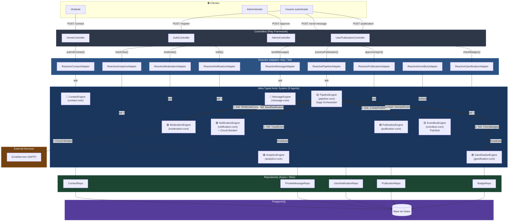
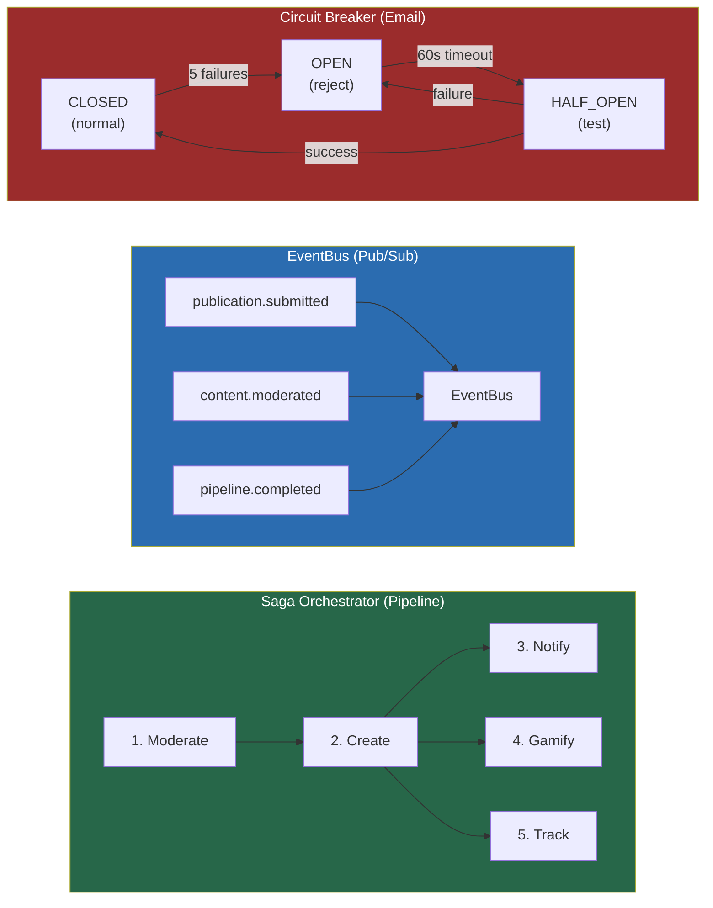

# ⚡ Reactive Manifesto

Aplicación web que implementa los principios del [Manifiesto Reactivo](https://www.reactivemanifesto.org/) con **Play Framework**, **Akka Typed** y **Scala**.

---

## 🛠️ Stack Tecnológico

| Capa | Tecnología |
|------|-----------|
| **Backend** | Play Framework 3.0.1 |
| **Lenguaje** | Scala 2.13.12 |
| **Sistema Reactivo** | Akka Typed 2.8.5 |
| **Persistencia** | Slick 3 + H2 (dev) / PostgreSQL (prod) |
| **Frontend** | Twirl templates, CSS3, Vanilla JS |
| **DI** | Guice |
| **Build** | SBT 1.9.7 |

---

## 🚀 Inicio Rápido

```bash
# Clonar
git clone https://github.com/federicopfund/Reactive-Manifiesto.git
cd Reactive-Manifiesto

# Ejecutar
sbt run
```

Disponible en **http://localhost:9000**

```bash
# Comando todo-en-uno (limpia, compila e inicia)
fuser -k 9000/tcp 2>/dev/null && sbt clean compile run
```

---

## 🏗️ Arquitectura de Agentes

El proyecto sigue una **arquitectura de agentes reactivos** con **9 actores Akka Typed** organizados en capas desacopladas, comunicados mediante **EventBus (Pub/Sub)** y **Saga Orchestrator**:



### Los 9 Agentes

| # | Agente | Sistema | Patrón | Responsabilidad |
|---|--------|---------|--------|-----------------|
| 🔵 | **ContactEngine** | `contact-core` | Ask | Formularios de contacto: persiste y responde |
| 🔵 | **MessageEngine** | `message-core` | Ask | Mensajería privada + notificaciones al receptor |
| 🟢 | **PublicationEngine** | `publication-core` | Ask | Ciclo de vida: crear → revisar → aprobar/rechazar |
| 🟢 | **GamificationEngine** | `gamification-core` | Tell | Verificación y otorgamiento de badges (fire-and-forget) |
| 🟢 | **NotificationEngine** | `notification-core` | Tell | Hub multi-canal con **Circuit Breaker** en email |
| 🟢 | **ModerationEngine** | `moderation-core` | Ask | Auto-filtrado de contenido + cola de revisión manual |
| 🟢 | **AnalyticsEngine** | `analytics-core` | Tell | Tracking de métricas in-memory (zero-latency) |
| 🟡 | **EventBusEngine** | `eventbus-core` | Pub/Sub | Bus de eventos de dominio con topic filtering + DeathWatch |
| 🟡 | **PipelineEngine** | `pipeline-core` | Saga | Orquestador: Moderate → Create → Notify → Gamify → Track |

> 🔵 = existente &nbsp; 🟢 = dominio &nbsp; 🟡 = infraestructura

### Comunicación inter-agente avanzada

Los agentes se comunican mediante tres patrones complementarios:

1. **EventBus (Pub/Sub)**: Eventos de dominio broadcasteados a suscriptores por topic
2. **Saga Orchestrator (Pipeline)**: Coordinación explícita de workflows multi-agente
3. **Circuit Breaker**: Protección resiliente de servicios externos (email SMTP)



### Saga: Flujo completo de publicación

```mermaid
sequenceDiagram
    participant U as Usuario
    participant C as Controller
    participant PL as PipelineEngine<br/>(Saga)
    participant MOD as ModerationEngine
    participant PUB as PublicationEngine
    participant NOT as NotificationEngine<br/>⚡ Circuit Breaker
    participant GAM as GamificationEngine
    participant ANA as AnalyticsEngine
    participant EB as EventBus<br/>(Pub/Sub)

    U->>C: POST /publication
    C->>PL: ask(ProcessNewPublication)
    activate PL
    Note over PL: correlationId = abc123

    PL->>EB: publish(PublicationSubmitted)
    PL->>ANA: tell(TrackEvent: pipeline.started)

    rect rgb(40, 80, 60)
        Note over PL,MOD: Stage 1: MODERATION (Ask)
        PL->>MOD: ask(ModerateContent)
        MOD-->>PL: ModerationResult(verdict, score, flags)
    end

    PL->>EB: publish(ContentModerated)

    alt verdict == "auto_rejected"
        PL->>NOT: tell(SendNotification: rejection)
        PL-->>C: PipelineRejected
    else verdict == "auto_approved" / "pending_review"
        rect rgb(40, 60, 80)
            Note over PL,PUB: Stage 2: CREATE (Ask)
            PL->>PUB: ask(CreatePublication)
            PUB-->>PL: PublicationCreatedOk(id)
        end

        par Stage 3: SIDE EFFECTS (Tell, parallel)
            PL->>NOT: tell(SendNotification)
            Note over NOT: Circuit Breaker<br/>gates email
        and
            PL->>GAM: tell(CheckBadges)
        and
            PL->>ANA: tell(TrackEvent: pipeline.completed)
        end

        PL->>EB: publish(PipelineCompleted)
        PL-->>C: PipelineSuccess(id, verdict, latency)
    end

    deactivate PL
    C-->>U: HTTP Response
```



---

## ✅ Principios Reactivos Implementados

| Principio | Implementación |
|-----------|---------------|
| **Responsive** | Non-blocking I/O en todas las capas. Timeouts de 5-30s en Ask Pattern. Fast-fail con manejo de errores |
| **Resilient** | Circuit Breaker en email. `pipeToSelf(Failure)` sin crashear actores. DeathWatch en EventBus. Saga con compensación |
| **Elastic** | Actor model permite escalado horizontal. Stateless controllers. Pipeline concurrente. Preparado para Akka Cluster |
| **Message-Driven** | Comunicación asíncrona vía mensajes tipados (`sealed trait`). EventBus Pub/Sub. Domain Events con correlationId |

---

## 📁 Estructura del Proyecto

```
Reactive-Manifiesto/
├── app/
│   ├── Module.scala                      # DI: provee 9 ActorSystems y 9 Adapters
│   ├── controllers/
│   │   ├── HomeController.scala          # Contacto, páginas públicas
│   │   ├── AuthController.scala          # Login, registro, verificación email
│   │   ├── UserPublicationController     # Publicaciones, mensajería, dashboard
│   │   ├── AdminController.scala         # Panel de administración
│   │   └── actions/
│   │       └── AuthAction.scala          # Acción de autenticación
│   ├── core/                             # 🧠 AGENTES (Akka Typed Actors)
│   │   ├── ContactEngine.scala           # 🔵 Formulario de contacto
│   │   ├── MessageEngine.scala           # 🔵 Mensajería privada
│   │   ├── PublicationEngine.scala       # 🟢 Ciclo de vida de publicaciones
│   │   ├── GamificationEngine.scala      # 🟢 Sistema de badges
│   │   ├── NotificationEngine.scala      # 🟢 Hub multi-canal + Circuit Breaker
│   │   ├── ModerationEngine.scala        # 🟢 Auto-moderación de contenido
│   │   ├── AnalyticsEngine.scala         # 🟢 Métricas y tracking
│   │   ├── DomainEvents.scala            # 🟡 Vocabulario de eventos de dominio
│   │   ├── EventBusEngine.scala          # 🟡 Bus Pub/Sub + DeathWatch
│   │   └── PublicationPipelineEngine.scala # 🟡 Saga Orchestrator
│   ├── services/                         # 🔌 ADAPTERS (Ask/Tell → Actors)
│   │   ├── ReactiveContactAdapter        # Ask → ContactEngine
│   │   ├── ReactiveMessageAdapter        # Ask → MessageEngine
│   │   ├── ReactivePublicationAdapter    # Ask → PublicationEngine
│   │   ├── ReactiveGamificationAdapter   # Tell → GamificationEngine
│   │   ├── ReactiveNotificationAdapter   # Tell → NotificationEngine
│   │   ├── ReactiveModerationAdapter     # Ask → ModerationEngine
│   │   ├── ReactiveAnalyticsAdapter      # Tell → AnalyticsEngine
│   │   ├── ReactiveEventBusAdapter       # Tell/Ask → EventBusEngine
│   │   ├── ReactivePipelineAdapter       # Ask → PipelineEngine (Saga)
│   │   ├── EmailService.scala            # SMTP email delivery
│   │   ├── EmailVerificationService      # Verificación de email
│   │   └── GamificationService.scala     # Legacy (reemplazado por Engine)
│   ├── models/                           # Case classes + Slick mappings
│   ├── repositories/                     # Data access layer (async)
│   └── views/                            # Templates Twirl
├── conf/
│   ├── application.conf                  # Configuración general
│   ├── routes                            # Rutas HTTP
│   ├── messages / messages.en            # i18n (es/en)
│   └── evolutions/                       # Migraciones de DB
├── public/                               # Assets estáticos
├── sql/                                  # Scripts SQL de administración
└── build.sbt                             # Definición del proyecto
```

---

## 🎯 Patrones de Diseño

| Patrón | Uso | Ubicación |
|--------|-----|-----------|
| **Actor Model** | Concurrencia sin locks, procesamiento asíncrono | 9 Engines en `core/` |
| **Ask Pattern** | Request-response sobre actores | Contact, Message, Publication, Moderation, Pipeline |
| **Tell Pattern** | Fire-and-forget, zero-latency | Gamification, Notification, Analytics |
| **Saga Orchestrator** | Workflow multi-agente coordinado | PublicationPipelineEngine |
| **Pub/Sub (EventBus)** | Broadcast desacoplado de domain events | EventBusEngine + DomainEvents |
| **Circuit Breaker** | Protección resiliente de servicios externos | NotificationEngine (email) |
| **Message Adapter** | Conversión de respuestas tipadas entre actores | PipelineEngine → Moderation/Publication |
| **Domain Events** | Vocabulario compartido con correlationId | DomainEvents.scala (9 event types) |
| **pipeToSelf** | Convertir Futures en mensajes del actor | Todos los Engines |
| **DeathWatch** | Auto-cleanup de suscriptores terminados | EventBusEngine |
| **Fan-out** | Un evento → múltiples canales | NotificationEngine (in-app + email) |
| **Compensating Action** | Notificación de rechazo al autor | PipelineEngine (saga rollback) |
| **Repository** | Abstracción de acceso a datos | 13 Repositories |
| **Adapter** | Puente entre Controllers y Actor System | 9 `Reactive*Adapter` |
| **Command** | Mensajes tipados como objetos | `sealed trait *Command` |
| **Dependency Injection** | Inversión de control (Guice) | `Module.scala` |
| **MVC** | Separación de responsabilidades | Controllers + Views + Models |

---

## 📝 Internacionalización

Soporte para español (predeterminado) e inglés via `conf/messages` y `conf/messages.en`.

---

## 👤 Autor

**Federico Pfund** — [@federicopfund](https://github.com/federicopfund)

## 📄 Licencia

MIT

---

<p align="center"><strong>Responsive • Resilient • Elastic • Message-Driven</strong></p>
